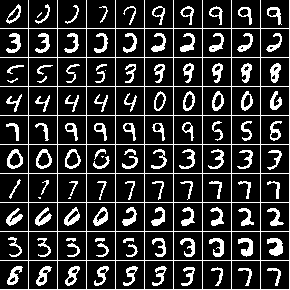

## binary-MNIST generation

Torch implementation for binary-MNIST generation experiment.

### Requirements
This code runs using torch. It is only tested on GPU. The following torch libraries are required:
nn, cunn, cudnn, optim, image, nngraph, dpnn([https://github.com/Element-Research/dpnn](https://github.com/Element-Research/dpnn))

MNSIT t7 dataset can be downloaded here: [https://github.com/torch/tutorials/blob/master/A_datasets/mnist.lua](https://github.com/torch/tutorials/blob/master/A_datasets/mnist.lua).
The dataset should be downloaded and placed under this folder, with the structure
```
.
+-- mnist
  +-- train_28x28.t7
  +-- test_28x28.t7
```


### Train
```
th main.lua
```

The output model: `$savename/model.t7`

### Generation
To generate:
```
th generate.lua --imgname output.png --modelpath ./$savename/model.t7
```
The output examplar generation: `output.png`

### Z-space interpolation
To interpolate:
```
th interpolate.lua --imgname int.png --modelpath ./$savename/model.t7
```
The output examplar interpolation: `int.png`.

Example of interpolation:      


